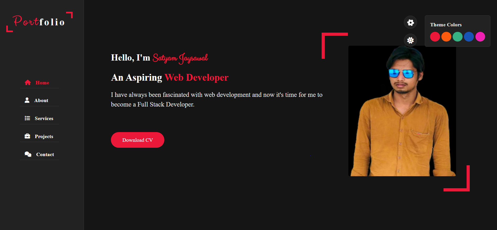
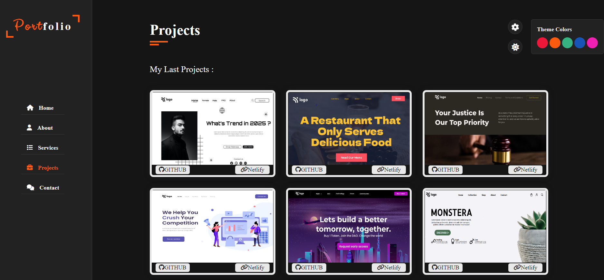
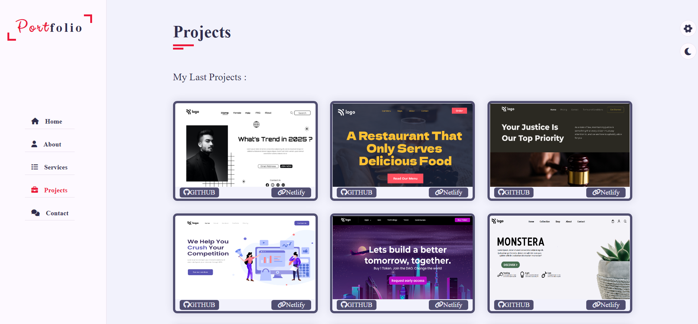

# 🚀 Responsive-Portfolio-using-HTML-CSS-JS-satyam_jaysawal 🚀
This is a Personal Responsive Portfolio page which is created using HTML, CSS & JS. This website is fully responsive for Mobile Phone and Tablet.

## 🔗Responsive-Portfolio-using-HTML-CSS-JS-satyam_jaysawal : _Screenshot_

## [__This is Personal Responsive Portfolio using Html, CSS & JS_]()

A HTML, CSS & JS Project. Made with ♥ by Satyam Jaysawal. There will be Home page,Project page & Contact page in the website. In this project we gonna learn how we can create a website using simple HTML, CSS. The main purpose of the project is to get more used to with HTML, CSS. Later on, in this project, we gonna learn how we can deploy this site using Netlify. Also, we gonna learn the process from the zero to end and make the website ready for live production.

## 🛠 Skills
HTML, CSS & JS...

## 🔗 What we are going to learn

- HTML, CSS
- CSS Flex
- Javascript
- Netlify Deployment
- More . . .

## 🔗 Time took to finish the project
It took me 9 hour to finish this project and it was fun working on it.

## 🔗 Tools Used

1. icons - (flat & Feather icons)
2. illustration - [https://storyset.com/](https://storyset.com/)
3. Code Editor: VS Code

## 🔗 FAQ

### How can i get started?

You can get started by following the ineuron Website and learn code online.

### What i need to start the project?

Just open your favorite code editor and follow along with the---

### Who the project is for?

The project is for the people who wanna get more skilled in HTML & CSS.
Source code is available on my Git hub link

🔗[Source code](https://github.com/satyamjaysawal/satyamjaysawal-Responsive-Portfolio-using-HTML-CSS-JS)

## 🚀 Deployed Link : _Netlify_

(https://responsive-portfolio-html-css-js.netlify.app/)

## Feedback

If you have any feedback, please reach out to us at ...

  
🔘[Twitter id ](https://twitter.com/s_jaysawal?t=zbTR9vw_U8lRNNDXL1rW4A&s=08)

  
🔘[linkedin profile](https://www.linkedin.com/in/satyam-jaysawal-9b58b7238)

## 🚀 About Me
I'm a Satyam Jaysawal and i am aspiring to be a Full Stack Web Developer.

📧[sjrecm9258@gmail.com](sjrecm9258@gmail.com)

